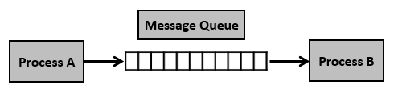

# 09. IPC \( InterProcess Communication\)

## 프로세스간 커뮤니케이션

* 프로세스는 다른 프로세스의 공간을 접근할 수 없다
* 프로세스간의 통신 방법 제공
  * 성능을 높이기 위해 여러 프로세스를 만들어서 동시 실행
  * 이 때 프로세스간 상태 확인 및 데이터 송수신이 필요

## 다양한 IPC 기법

* **저장매체** 사용
  * file 사용
    * 간단히 다른 프로세스에 전달할 내용을 파일에 쓰고, 다른 프로세스가 해당   파일을 읽으면 됨
    * 성능이 느리다.
    * 실시간성도 떨어진다.
* **커널** 사용
  * 대부분의 IPC 기법은 결국 _커널 공간을 활용_한다.
  * 기법 종류
    * Message Queue
    * Shared Memory
    * Pipe
    * Signal
    * Semaphore
    * Socket  

### 파이프 \(Pipe\)

* 기본 파이프는 단방향 통신
* fork\(\)로 자식 프로세스를 만들었을 때, 부모와 자식간의 통신
* 2개의 공간을 가지는 int 배열을 파라미터로 받음.
  * 부모는 int\[1\] 으로 write
  * 자식은 int\[0\] 으로 read

### 메시지 큐 \(message queue\)

* FIFO 정책으로 데이터 전송
* 부모/자식이 아니라, 어느 프로세스간에도 데이터 송수신이 가능
* 먼저 넣은 데이터가, 먼저 읽혀진다.
* 단방향 및 양방향도 가능하다.
  * A,B 프로세스가 각각 A-&gt;B , B-&gt;A로 전송하는 queue를 생성하여 가능.

### 공유 메모리 \(shared memory\)

* 노골적으로 kernel space에 메모리 공간을 만들고, 해당 공간을 변수처럼 쓰는 방식
* message quque 처럼 FIFO 방식이 아니라, 해당 메모리 주소를 마치 변수처럼 접근하는 방식
* 공유메모리 key를 가지고, 여러 프로세스가 접근 가능

### 시그널 \(signal\)

* 커널 또는 프로세스에서 다른 프로세스에 어떤 이벤트가 발생되었는지를 알려주는 기법
* 프로레스 관련 코드에 관련 시그널 핸들러를 등록해서, 해당 시그널 처리 실행
  * 시그널 무시
  * 시그널 블록
  * 등록된 시그널 핸들러로 특정 동작 수행
  * 등록된 시그널 핸들러가 없다면, 커널에서 기본 동작 수행
* PCB에 해당 프로세스가 블록 또는 처리해야하는지 시그널 정보 관리

### 소켓 \(socket\)

* 소켓은 네트워크 통신을 위한 기술
* 기본적으로는 클라이언트와 서버등 두 개의 다른 컴퓨터간의 네트워크 기반 통신을 위한 기술

